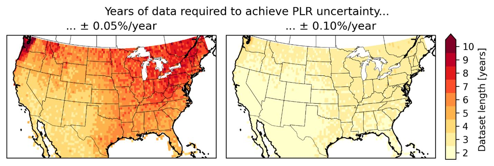

About PV Atlas
==============

.. warning::
    This website is a work-in-progress prototype.

This is the website for PV Atlas, a project led by the
PV Performance Modeling Collaborative (`PVPMC <http://pvpmc.sandia.gov>`_).

PV Atlas investigates the effect of climate and geography on
various aspects of photovoltaic (PV) performance modeling and analysis.
For example, how does climate affect the optimal tilt angle
for a PV array?  Does the energy gain from antireflective coating
vary regionally?  What geographic patterns exist in interannual
solar resource variability?  By applying scalable PV performance modeling tools to
gridded weather and irradiance datasets,  PV Atlas can perform detailed simulation
case studies to answer these kinds of questions.  

For example, here is a heatmap showing the number of years of data needed
to achieve a given level of certainty in performance loss rate estimates
(taken from :cite:t:`Theristis2023srrl`):

Acknowledgement
---------------

This material is based upon work supported by the U.S. Department of
Energy's Office of Energy Efficiency and Renewable Energy (EERE) under
the Solar Energy Technologies Office Award Number 38267.

Free and open-source software is a key enabler of modern scientific computing.
This project uses many open-source software packages, including:

- `pvlib <https://pvlib-python.readthedocs.io>`_: PV performance modeling
- `RdTools <https://rdtools.readthedocs.io>`_: performance loss rate estimation
- `leaflet <https://leaflet.js/>`_, `georaster <https://github.com/GeoTIFF/georaster>`_, `cartopy <https://scitools.org.uk/cartopy/docs/latest/>`_: mapping
- `matplotlib <https://matplotlib.org/>`_: plotting
- `pandas <https://pandas.pydata.org/docs>`_, `numpy <https://numpy.org/doc/stable/>`_: number crunching
- `sphinx <https://www.sphinx-doc.org>`_, `sphinx-book-theme <https://sphinx-book-theme.readthedocs.io>`_: building this website
- `rasterio <https://rasterio.readthedocs.io>`_, `rioxarray <https://corteva.github.io/rioxarray/stable/>`_, `GDAL <https://gdal.org/index.html>`_: geospatial rasters
- and many others

.. toctree::
   :hidden:
   :maxdepth: 2
   :caption: About

   self
   methodology
   data
   publications

.. toctree::
   :hidden:
   :maxdepth: 2
   :caption: Chapters

   chapter/climatic-influence-plr
   chapter/solar-resource-variability
   chapter/racking-configuration
   chapter/anti-reflective-coatings
   chapter/spectral-mismatch
   chapter/temperature-coefficients
